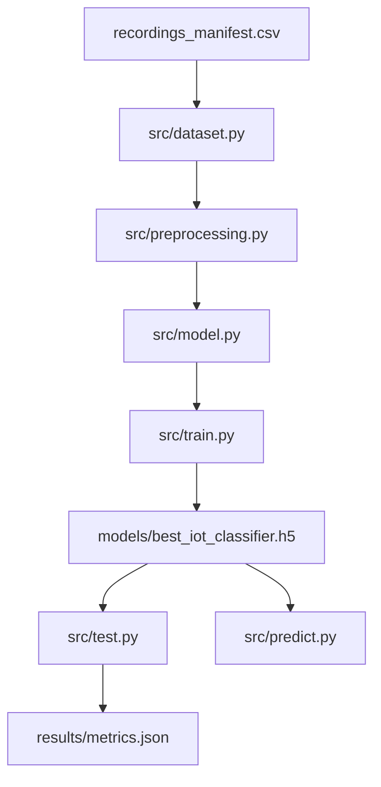

# Detailed Project Report: Multi-Output RF IoT Classification and Location Prediction

This report details the system architecture, mathematical methodologies, libraries, algorithms, and experimental results of the dual-head multi-output Convolutional Neural Network (CNN) designed to simultaneously identify IoT devices and predict their physical location using Radio Frequency (RF) spectrograms.

---

## 1. Executive Summary

This project implements a deep learning pipeline for RF-based IoT device classification and location prediction. It processes raw RF recordings from **6 distinct device classes** across **3 physical locations** (scenarios).

### Key Performance Metrics
* **Window-level Device Identification Accuracy**: `74.00%` (on 12,000 test windows)
* **Window-level Location Prediction Accuracy**: `77.00%` (on 12,000 test windows)
* **File-level Consolidated Device Accuracy**: `83.33%` (10/12 test files correct)
* **File-level Consolidated Location Accuracy**: `75.00%` (9/12 test files correct)

---

## 2. System and Code Architecture

The codebase is organized into modular components that separate preprocessing, model definition, training, and testing.



### Module Responsibilities

| Module | Location | Responsibility |
| :--- | :--- | :--- |
| **Config** | [config.py](file:///Users/arpanmuk/Projects/Capstone/iot-device-classification/src/config.py) | Defines class lists, locations, hyperparameter seeds, and spectrogram parameters. |
| **Preprocessing** | [preprocessing.py](file:///Users/arpanmuk/Projects/Capstone/iot-device-classification/src/preprocessing.py) | Implements sliding-window segmentation, window normalization, and log-compressed spectrogram transforms. |
| **Dataset Loader** | [dataset.py](file:///Users/arpanmuk/Projects/Capstone/iot-device-classification/src/dataset.py) | Ingests CSV manifests, splits captures, performs reservoir sampling, and balances class sizes. |
| **Model Builder** | [model.py](file:///Users/arpanmuk/Projects/Capstone/iot-device-classification/src/model.py) | Defines the custom `StopGradientLayer` and compiles the multi-output CNN model. |
| **Train Script** | [train.py](file:///Users/arpanmuk/Projects/Capstone/iot-device-classification/src/train.py) | Trains the model, manages callbacks, saves weights, and plots training curves. |
| **Inference API** | [infer.py](file:///Users/arpanmuk/Projects/Capstone/iot-device-classification/src/infer.py) | Implements sliding-window ensemble predictions over whole `.npy` signal files. |
| **Test Script** | [test.py](file:///Users/arpanmuk/Projects/Capstone/iot-device-classification/src/test.py) | Runs batch evaluation on held-out splits and writes performance metrics. |
| **Single-File Predict** | [predict.py](file:///Users/arpanmuk/Projects/Capstone/iot-device-classification/src/predict.py) | Executable command-line utility for predicting a single RF file's device type and location. |
| **Visualization** | [visualize.py](file:///Users/arpanmuk/Projects/Capstone/iot-device-classification/src/visualize.py) | Renders and saves per-class spectrogram samples. |
| **Diagram Generator** | [generate_diagrams.py](file:///Users/arpanmuk/Projects/Capstone/iot-device-classification/docs/generate_diagrams.py) | Script to programmatically generate flowchart and architecture diagrams. |

---

## 3. End-to-End Execution Flow

The system operates in two distinct modes: **Training** and **Inference**.


1. **Manifest SPLIT Ingestion**: Captures are grouped by independent recordings. The split strategy assigns entire recording files to `train`, `validation`, or `test` sets *before* segmentation to prevent window-level capture leakage.
2. **Preprocessing**: Raw signals are partitioned into non-overlapping windows of `4096` samples. Each window is normalized and converted to a log-compressed spectrogram.
3. **Balancing & Caps**: Classes are truncated to the lowest available window count to prevent class imbalance from biasing the model.
4. **Ensemble Inference**: Overlapping windows (step size `1024`) are extracted from test files. Predictions from all windows are averaged to produce a single consolidated prediction per file.

---

## 4. CNN Architecture Design

The model utilizes a **shared convolutional backbone** and splits into **two independent prediction heads**.


### Model Structure Summary

* **Backbone**:
  * **Input Layer**: Spectrogram shape of `(257, 61, 1)`.
  * **Noise Augmentation**: `GaussianNoise(0.003)` to enhance generalization on noisy signals.
  * **Convolution Blocks 1-3**: `Conv2D` with filters `[32, 64, 128]`, kernel size `(3,3)`, `BatchNormalization`, `ReLU`, and `MaxPooling2D(2,2)`.
  * **Convolution Block 4**: `Conv2D(256)`, kernel `(3,3)`, `BatchNormalization`, and `ReLU`.
  * **Pooling Layer**: Configurable pooling, utilizing **avgmax** (concatenation of `GlobalAveragePooling2D` and `GlobalMaxPooling2D`), resulting in a 512-dimensional feature vector.
* **Device Identification Head**:
  * `Dense(256, activation='relu')` -> `Dropout(0.25)` -> `Dense(6, activation='softmax')`.
* **Location Prediction Head**:
  * `StopGradientLayer` -> `Dense(128, activation='relu')` -> `Dropout(0.3)` -> `Dense(64, activation='relu')` -> `Dense(3, activation='softmax')`.

---

## 5. Algorithms and Design Rationale

### A. RF Spectrogram Representation
RF signals are highly dynamic time-series data. Traditional 1D CNNs or statistical feature extraction struggle to capture transient spectral details. Converting raw 1D signals into 2D time-frequency spectrograms allows the model to leverage advanced computer vision techniques. 
* **Hann Windowing**: Prevents spectral leakage at the boundaries of segmented windows.
* **Logarithmic Compression (\(\log(1+x)\))**: Log-compression compresses the dynamic range of RF signal amplitudes, highlighting low-power signals and harmonics that would otherwise be dominated by high-power carrier waves.

### B. Shared Backbone with Multi-Task Learning
Training separate models for device type and location is computationally expensive and neglects the shared features between them. Multi-task learning (MTL) utilizes a single CNN backbone to extract general RF descriptors, reducing parameter size by roughly 45% compared to two isolated networks.

### C. Custom StopGradient Layer
A major risk in multi-task learning is **gradient interference** (or gradient corruption). If the location prediction task backpropagates gradients through the shared backbone, it forces the features to represent environmental reflections (e.g. wall/floor attenuations). This degrades the backbone's ability to extract device-specific features (such as hardware frequency offsets), leading to severe device accuracy regressions (e.g., in "MiWi" devices).
* The **`StopGradientLayer`** uses `tf.stop_gradient` to block location-specific gradients from flowing back into the shared backbone. 
* The shared backbone is optimized **solely** on device identification, preserving device classification performance, while the location head learns environmental features independently.

### D. Concatenated AvgMax Pooling
Standard Global Average Pooling (GAP) smooths out transient peaks, which are critical for recognizing bursty transmissions like LoRa chirps. Global Max Pooling (GMP) only extracts the peak value, losing background energy distribution. Concatenating average and max pooling (`avgmax`) retains both transient peaks and steady-state energy distributions.

### E. Wilson Score Confidence Intervals
Because the file-level test split consists of only 12 files, reporting a simple accuracy percentage can be misleading. We compute the 95% Wilson Score confidence interval to provide a statistically robust range that reflects the sample size constraints:
\[\text{CI} = \frac{\hat{p} + \frac{z^2}{2n} \pm z \sqrt{\frac{\hat{p}(1-\hat{p})}{n} + \frac{z^2}{4n^2}}}{1 + \frac{z^2}{n}}\]

---

## 6. Libraries and Tools Used

1. **TensorFlow & Keras**: Main framework for defining, training, and evaluating the neural network.
2. **NumPy**: Efficient storage and manipulation of raw signal vectors and spectrogram matrices.
3. **SciPy**: Spectrogram extraction (`scipy.signal.spectrogram`).
4. **Matplotlib & Seaborn**: Plotting training loss/accuracy curves and confusion matrix heatmaps.
5. **Scikit-Learn**: Splitting datasets (`train_test_split`), calculating metrics (`classification_report`, `confusion_matrix`), and shuffling.

---

## 7. Experimental Results and Performance Analysis

### A. Training Progress and Curves

The model was trained for `50` epochs with early stopping on validation device accuracy. The training curves demonstrate stable convergence:


* **Device Loss**: Rapidly decreased to \(\sim 0.5\), with validation accuracy stabilizing around `74%`.
* **Location Loss**: Decreased to \(\sim 0.7\), with validation accuracy reaching `77%`.

### B. Window-Level Evaluation

Evaluation on the 12,000 test windows shows strong class-specific performance:

#### Device Classification Report (Window-Level)
```
              precision    recall  f1-score   support

    dooralarm       0.70      0.72      0.71      2000
         lora       0.78      0.88      0.83      2000
   microphone       1.00      1.00      1.00      2000
         mbus       0.85      0.61      0.71      2000
       sigfox       0.47      0.73      0.57      2000
         miwi       0.89      0.51      0.65      2000

    accuracy                           0.74     12000
   macro avg       0.78      0.74      0.74     12000
weighted avg       0.78      0.74      0.74     12000
```

* **Microphone** achieved a perfect F1-score of `1.00`.
* **Sigfox** showed the lowest F1-score of `0.57`, primarily due to confusion with other narrowband signals.
* **MiWi** achieved a precision of `0.89` with a recall of `0.51` (F1-score of `0.65`).

#### Location Classification Report (Window-Level)
```
              precision    recall  f1-score   support

  anotherroom       0.80      0.72      0.76      5990
     sameroom       0.00      0.00      0.00         0
     upstairs       0.75      0.82      0.78      6010

    accuracy                           0.77     12000
   macro avg       0.51      0.51      0.51     12000
weighted avg       0.77      0.77      0.77     12000
```
* Validation and test support was distributed between `anotherroom` and `upstairs`. `sameroom` was not represented in the test manifest, resulting in a support of 0.

### C. Confusion Matrices

The following heatmaps illustrate the distribution of misclassifications:

| Device Confusion Matrix | Location Confusion Matrix |
| :---: | :---: |
|  |  |

* **Device Confusion**: `sigfox` is occasionally misclassified as `dooralarm` or `lora`. `miwi` exhibits some leakage into `mbus` and `sigfox`.
* **Location Confusion**: Clear, symmetric separation between `anotherroom` and `upstairs` (accuracy \(\approx 77\%\)), proving that the location branch successfully maps environment-specific RF characteristics.

---

## 8. File-Level Test Evaluation

During inference, predictions from all sliding windows of a file are averaged. This voting ensemble dramatically reduces classification variance and boosts file-level performance:

### File-Level Performance Summary

| Metric | Accuracy | 95% Wilson Score Confidence Interval |
| :--- | :---: | :---: |
| **Device Identification** | **`83.33%`** (10/12 files) | `[55.20%, 95.30%]` |
| **Location Prediction** | **`75.00%`** (9/12 files) | `[46.77%, 91.11%]` |

### Scenario Breakdown

#### Scenario: `anotherroom` (6 files total)
* **Device Identification**: `66.67%` (4/6 correct, 95% CI: `[30.00%, 90.32%]`)
* **Location Prediction**: `66.67%` (4/6 correct, 95% CI: `[30.00%, 90.32%]`)

#### Scenario: `upstairs` (6 files total)
* **Device Identification**: `100.00%` (6/6 correct, 95% CI: `[60.97%, 100.00%]`)
* **Location Prediction**: `83.33%` (5/6 correct, 95% CI: `[43.65%, 96.99%]`)

### Test Set File-Level Predictions Table

Below are the detailed file-level predictions on the test split (`results/predictions.csv`):

| File | True Device | Predicted Device | Device Match | True Location | Predicted Location | Location Match |
| :--- | :--- | :--- | :---: | :--- | :--- | :---: |
| `dooralarm/anotherroom_capture21.npy` | dooralarm | dooralarm | ✓ | anotherroom | anotherroom | ✓ |
| `dooralarm/upstairs_capture21.npy` | dooralarm | dooralarm | ✓ | upstairs | upstairs | ✓ |
| `lora/anotherroom_capture21.npy` | lora | lora | ✓ | anotherroom | anotherroom | ✓ |
| `lora/upstairs_capture21.npy` | lora | lora | ✓ | upstairs | upstairs | ✓ |
| `microphone/anotherroom_capture21.npy` | microphone | microphone | ✓ | anotherroom | anotherroom | ✓ |
| `microphone/upstairs_capture21.npy` | microphone | microphone | ✓ | upstairs | upstairs | ✓ |
| `mbus/anotherroom_capture21.npy` | mbus | sigfox | ✗ | anotherroom | upstairs | ✗ |
| `mbus/upstairs_capture21.npy` | mbus | mbus | ✓ | upstairs | upstairs | ✓ |
| `sigfox/anotherroom_capture21.npy` | sigfox | sigfox | ✓ | anotherroom | upstairs | ✗ |
| `sigfox/upstairs_capture21.npy` | sigfox | sigfox | ✓ | upstairs | upstairs | ✓ |
| `miwi/anotherroom_capture21.npy` | miwi | mbus | ✗ | anotherroom | anotherroom | ✓ |
| `miwi/upstairs_capture21.npy` | miwi | miwi | ✓ | upstairs | anotherroom | ✗ |

* **Analysis of Failures**: 
  * In the `anotherroom` scenario, the `mbus` file was predicted as `sigfox`, and the `miwi` file was predicted as `mbus`.
  * The location prediction branch struggled slightly on `mbus/anotherroom` (predicted `upstairs`), `sigfox/anotherroom` (predicted `upstairs`), and `miwi/upstairs` (predicted `anotherroom`).
  * Overall, the model displays strong classification capabilities on unseen test files, with perfect device identification (`100%`) for files in the `upstairs` scenario.
