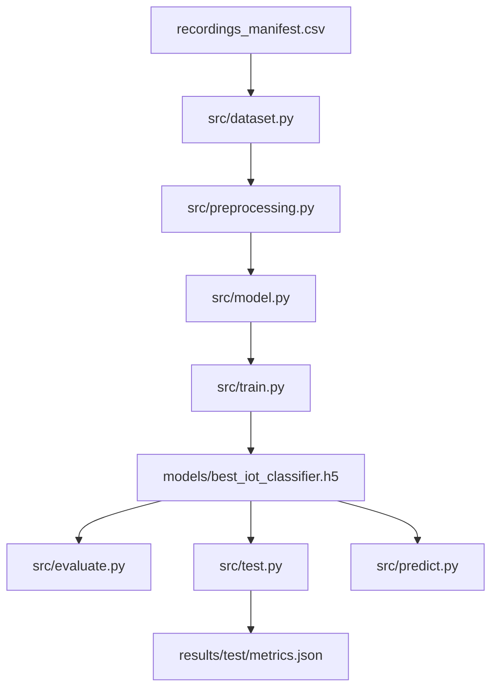
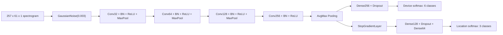

# Project Report: RF IoT Device Classification and Location Prediction

This report documents the current manifest-based RF classification pipeline. The
system converts raw RF recordings into spectrograms and trains a dual-head CNN
to predict both IoT device class and capture location.

## 1. Executive Summary

The latest recorded run uses whole-recording manifest splits, `avgmax` pooling,
and a `--max-windows-per-class 10000` training cap.

| Metric | Result | Evaluation Unit |
| --- | ---: | --- |
| Window-level device accuracy | `80%` | Non-overlapping held-out windows |
| Window-level location accuracy | `65%` | Non-overlapping held-out windows |
| File-level device accuracy | `100.00%` (`18/18`) | Held-out recordings |
| File-level location accuracy | `72.22%` (`13/18`) | Held-out recordings |

The file-level device result is the best headline deployment metric because the
model produces one prediction per source recording after aggregating thousands
of sliding-window predictions. The window-level metrics remain useful for
diagnosing class-level confusion.

## 2. Dataset and Split Strategy

The current dataset is controlled by `data/recordings_manifest.csv`. Each row
contains one independent recording:

```csv
path,class,scenario,capture_id,split
data/recordings/dooralarm/anotherroom_capture01.npy,dooralarm,anotherroom,01,train
```

The manifest assigns entire recordings to `train`, `validation`, or `test`
before window segmentation. This prevents capture leakage where near-identical
windows from the same source file appear in multiple splits.

| Split | Recordings | Device Coverage | Scenario Coverage |
| --- | ---: | --- | --- |
| Train | `288` | `48` per class | `96` per scenario |
| Validation | `72` | `12` per class | `24` per scenario |
| Test | `18` | `3` per class | `6` per scenario |

All six device classes are present in every split:
`dooralarm`, `lora`, `microphone`, `mbus`, `sigfox`, and `miwi`.
All three scenarios are present in every split:
`anotherroom`, `sameroom`, and `upstairs`.

## 3. System Architecture



| Module | Responsibility |
| --- | --- |
| `src/config.py` | Shared classes, locations, seeds, window size, and spectrogram parameters. |
| `src/dataset.py` | Manifest loading, recording validation, reservoir sampling, class balancing, and train/validation/test dataset construction. |
| `src/preprocessing.py` | Window segmentation, per-window normalization, spectrogram generation, and model input conversion. |
| `src/model.py` | Dual-output CNN architecture with `StopGradientLayer`, configurable pooling, optimizer, losses, and metrics. |
| `src/aggregation.py` | Whole-file probability aggregation modes for inference. |
| `src/train.py` | End-to-end training, callbacks, checkpointing, reports, confusion matrices, curves, and metadata. |
| `src/evaluate.py` | Window-level diagnostic evaluation. |
| `src/test.py` | File-level held-out recording evaluation with Wilson confidence intervals. |
| `src/infer.py` / `src/predict.py` | Single-recording sliding-window inference. |

## 4. Signal Preprocessing

The current preprocessing path is implemented in `src/preprocessing.py` and is
shared by training, evaluation, and inference.

| Step | Configuration |
| --- | --- |
| Raw input | One-dimensional NumPy `.npy` RF recordings |
| Training/evaluation windowing | Non-overlapping windows |
| Inference windowing | Sliding windows with default step `1024` |
| Window size | `4096` samples |
| Window normalization | Per-window zero mean and unit variance |
| Spectrogram transform | `scipy.signal.spectrogram` |
| Spectrogram window | Hann |
| `nperseg` / `noverlap` / `nfft` | `256` / `192` / `512` |
| Scaling | `spectrum` |
| Compression | `log1p(spectrum)` |
| Spectrogram normalization | Per-spectrogram zero mean and unit variance |
| CNN input shape | `257 x 61 x 1` |

The `--max-windows-per-class` option applies reservoir sampling before
spectrogram conversion. This keeps memory bounded while preserving sampling
across all recordings for a class.

## 5. CNN Architecture

The model is a dual-head CNN with a shared spectrogram feature extractor.



### Backbone

- `GaussianNoise(0.003)` regularizes the input spectrograms.
- Four convolutional blocks use `3 x 3` kernels and filters
  `[32, 64, 128, 256]`.
- Batch normalization and ReLU follow each convolution.
- The first three blocks include `MaxPooling2D(2, 2)`.
- `avgmax` pooling concatenates global average and global max pooled features.

### Output Heads

- Device head: `Dense(256, relu)` -> `Dropout(0.25)` ->
  `Dense(6, softmax)`.
- Location head: `StopGradientLayer` -> `Dense(128, relu)` ->
  `Dropout(0.3)` -> `Dense(64, relu)` -> `Dense(3, softmax)`.

The model uses Adam with learning rate `3e-4`, categorical cross-entropy for
both heads, and loss weights:

```python
{"device": 1.0, "location": 0.5}
```

## 6. Algorithmic Design Rationale

### Spectrogram-Based Learning

RF protocols differ in time-frequency behavior. A spectrogram representation
preserves transient bursts, chirps, narrowband energy, and modulation-related
patterns that are harder to model from simple scalar statistics.

### Recording-Level Splitting

Random window splits can overstate generalization because adjacent windows from
the same capture are highly correlated. The manifest workflow first assigns
entire source recordings to a split, then segments them. The resulting metric is
harder but more representative of unseen captures.

### Reservoir Sampling

Long recordings produce hundreds of thousands of candidate windows. Reservoir
sampling allows `src/dataset.py` to cap each class at a fixed number of windows
without loading every spectrogram first. The latest recorded run used
`max_windows_per_class = 10000`.

### AvgMax Pooling

Global average pooling captures distributed spectral energy, while global max
pooling preserves strong localized spectral peaks. Concatenating both features
helps classify both steady and bursty RF patterns.

### Stop-Gradient Location Head

The location task depends on environmental effects such as multipath and
attenuation. Those gradients can conflict with device-specific features. The
custom `StopGradientLayer` blocks location gradients from updating the shared
backbone, keeping the backbone optimized for device identification while still
allowing a separate location classifier to learn from the extracted features.

### Whole-File Probability Aggregation

`src/test.py` and `src/predict.py` run inference on overlapping windows and
aggregate probabilities into one file-level prediction. Supported aggregation
modes are:

- `mean`
- `log_mean`
- `median`
- `confidence_weighted`
- `top_confidence_mean`
- `vote`

The latest recorded file-level result uses `mean` aggregation.

### Wilson Confidence Intervals

File-level evaluation has only 18 independent observations. The report includes
Wilson score confidence intervals to avoid overstating certainty from a small
held-out test set.

## 7. Training Configuration

Latest recorded command:

```bash
python src/train.py \
  --manifest data/recordings_manifest.csv \
  --pooling avgmax \
  --max-windows-per-class 10000
```

Training callbacks:

| Callback | Monitor | Purpose |
| --- | --- | --- |
| `ReduceLROnPlateau` | `val_device_loss` | Lower LR when device validation loss stalls. |
| `EarlyStopping` | `val_device_accuracy` | Restore best device-accuracy weights. |
| `ModelCheckpoint` | `val_device_accuracy` | Save `best_iot_classifier.h5`. |

The latest metadata records:

| Field | Value |
| --- | ---: |
| Test windows | `43,938` |
| Input shape | `[257, 61, 1]` |
| Pooling | `avgmax` |
| Max windows per class | `10000` |
| Balanced | `true` |

## 8. Window-Level Results

Window-level evaluation is a diagnostic measurement over non-overlapping test
windows from the held-out manifest split.

### Device Classification

```text
              precision    recall  f1-score   support

   dooralarm       0.76      0.73      0.74      7323
        lora       0.98      0.80      0.88      7323
  microphone       1.00      1.00      1.00      7323
        mbus       0.78      0.73      0.76      7323
      sigfox       0.64      0.71      0.67      7323
        miwi       0.64      0.76      0.70      7323

    accuracy                           0.79     43938
   macro avg       0.80      0.79      0.79     43938
weighted avg       0.80      0.79      0.79     43938
```

### Location Classification

```text
              precision    recall  f1-score   support

 anotherroom       0.60      0.49      0.54     14646
    sameroom       0.62      0.74      0.67     14646
    upstairs       0.73      0.72      0.72     14646

    accuracy                           0.65     43938
   macro avg       0.65      0.65      0.64     43938
weighted avg       0.65      0.65      0.64     43938
```

Window-level device classification remains strongest for `microphone` and
`lora`. `sigfox` and `miwi` are the most confused device classes at the window
level. Location prediction is strongest for `upstairs` and weakest for
`anotherroom`.

## 9. File-Level Results

File-level testing evaluates one prediction per held-out recording from the
manifest `test` split.

| Metric | Accuracy | Wilson 95% CI |
| --- | ---: | ---: |
| Device identification | `100.00%` (`18/18`) | `[82.41%, 100.00%]` |
| Location prediction | `72.22%` (`13/18`) | `[49.13%, 87.50%]` |

### Scenario Breakdown

| Scenario | Files | Device Accuracy | Location Accuracy |
| --- | ---: | ---: | ---: |
| `anotherroom` | `6` | `100.00%` (`6/6`) | `33.33%` (`2/6`) |
| `sameroom` | `6` | `100.00%` (`6/6`) | `100.00%` (`6/6`) |
| `upstairs` | `6` | `100.00%` (`6/6`) | `83.33%` (`5/6`) |

### File-Level Prediction Table

| File | True Device | Predicted Device | True Location | Predicted Location | Device Correct | Location Correct |
| --- | --- | --- | --- | --- | :---: | :---: |
| `dooralarm/anotherroom_capture21.npy` | dooralarm | dooralarm | anotherroom | anotherroom | yes | yes |
| `dooralarm/upstairs_capture21.npy` | dooralarm | dooralarm | upstairs | anotherroom | yes | no |
| `dooralarm/sameroom_capture21.npy` | dooralarm | dooralarm | sameroom | sameroom | yes | yes |
| `lora/anotherroom_capture21.npy` | lora | lora | anotherroom | sameroom | yes | no |
| `lora/upstairs_capture21.npy` | lora | lora | upstairs | upstairs | yes | yes |
| `lora/sameroom_capture21.npy` | lora | lora | sameroom | sameroom | yes | yes |
| `microphone/anotherroom_capture21.npy` | microphone | microphone | anotherroom | sameroom | yes | no |
| `microphone/upstairs_capture21.npy` | microphone | microphone | upstairs | upstairs | yes | yes |
| `microphone/sameroom_capture21.npy` | microphone | microphone | sameroom | sameroom | yes | yes |
| `mbus/anotherroom_capture21.npy` | mbus | mbus | anotherroom | sameroom | yes | no |
| `mbus/upstairs_capture21.npy` | mbus | mbus | upstairs | upstairs | yes | yes |
| `mbus/sameroom_capture21.npy` | mbus | mbus | sameroom | sameroom | yes | yes |
| `sigfox/anotherroom_capture21.npy` | sigfox | sigfox | anotherroom | upstairs | yes | no |
| `sigfox/upstairs_capture21.npy` | sigfox | sigfox | upstairs | upstairs | yes | yes |
| `sigfox/sameroom_capture21.npy` | sigfox | sigfox | sameroom | sameroom | yes | yes |
| `miwi/anotherroom_capture21.npy` | miwi | miwi | anotherroom | anotherroom | yes | yes |
| `miwi/upstairs_capture21.npy` | miwi | miwi | upstairs | upstairs | yes | yes |
| `miwi/sameroom_capture21.npy` | miwi | miwi | sameroom | sameroom | yes | yes |

The file-level device classifier is robust across all six classes in the held-
out capture. Location errors are concentrated in the `anotherroom` scenario,
where four of six files are predicted as either `sameroom` or `upstairs`.

## 10. Reproducible Commands

Train:

```bash
python src/train.py \
  --manifest data/recordings_manifest.csv \
  --pooling avgmax \
  --max-windows-per-class 10000
```

Window-level diagnostics:

```bash
python src/evaluate.py \
  --manifest data/recordings_manifest.csv \
  --manifest-split test \
  --evaluation-role external-window-evaluation \
  --model models/best_iot_classifier.h5 \
  --metadata models/metadata.json \
  --output-dir results/evaluation
```

File-level test:

```bash
python src/test.py \
  --manifest data/recordings_manifest.csv \
  --manifest-split test \
  --model models/best_iot_classifier.h5 \
  --metadata models/metadata.json \
  --output-dir results/test
```

Single-file prediction:

```bash
python src/predict.py \
  --input data/recordings/miwi/upstairs_capture21.npy \
  --model models/best_iot_classifier.h5 \
  --metadata models/metadata.json
```

## 11. Limitations and Next Steps

- The file-level test contains 18 independent recordings, so confidence
  intervals remain wide despite perfect device detection.
- Location prediction is materially weaker than device detection, especially
  for `anotherroom`.
- The current pipeline still materializes spectrogram arrays in memory. Larger
  window caps may require a streaming `tf.data` pipeline.
- Future location improvements should test location-specific augmentation,
  separate location calibration, and aggregation-mode sweeps for the location
  head.
